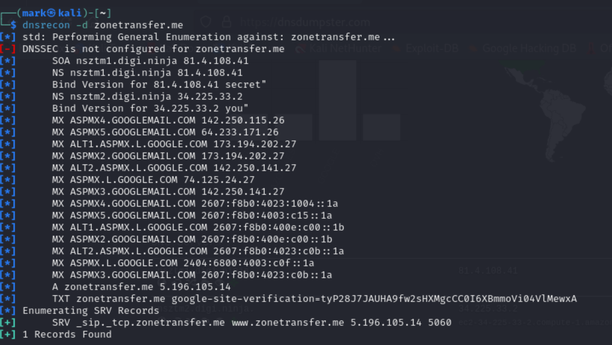
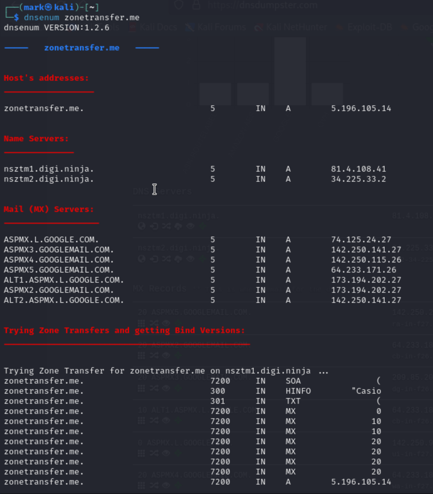

[Introduction to  Information Gathering](../Introduction%20to%20%20Information%20Gathering.md)
## What is DNS ?
- Domain Name System : A protocol to resolve hostname to IP address
	- eg : Google.com --> IP address of the domain
	- DNS **resolves** human readable domain website into IP address so client can access to the host server
		- Long time ago, people remembered the IP to access websites
	- Some famous DNS servers are **Cloudflare (1.1.1.1) and Google (8.8.8.8)**. These **DNS servers contain the records of almost all domains on the internet.**
		- You can check you router to see what DNS server you are using
- What are some of the DNS records saved in DNS server?
	1. A : Resolves host name -> IPv4 address
	2. AAAA : Resolves host name -> IPv6 address
	3. NS : Reference to the domains name server
	4. MX : Resolves a domain to a mail server 
	5. TXT : Text record
	6. SOA : Domain authority
	7. PTR : Resolves an IP to a hostname (Opposite of A and AAAA)
	8. SRV : Service Records
	9. CNAME : creates domain aliases
- **DNS interrogation** : Process of enumerating DNS records. 
- **DNS Zone Transfer** : Process where server admins want to copy or transfer zone files ( DNS records ) from one DNS server to another
	- Misconfiguration can cause the zone file to become vulnerable and easy to gained by recon

## Practical demo on DNS recon
- Target : [zonetransfer.me](https://digi.ninja/projects/zonetransferme.php)
	- An educational website teach you about DNS and Zone Transfer
- dnsdumpster: It provided certain level of information but not useful enough

- dnsrecon: Provides similar results as dnsdumpster but easier

- dnsenum: gets DNS data but also attempts zone transfer. This is brute force attack

- dig : a utility tool to zonetranfer
	- `dig {axfr} {domain name}`
- fierce :  a lightweight tool using zonetransfer and bruteforce
	- `fierce -dns {domain name}`
