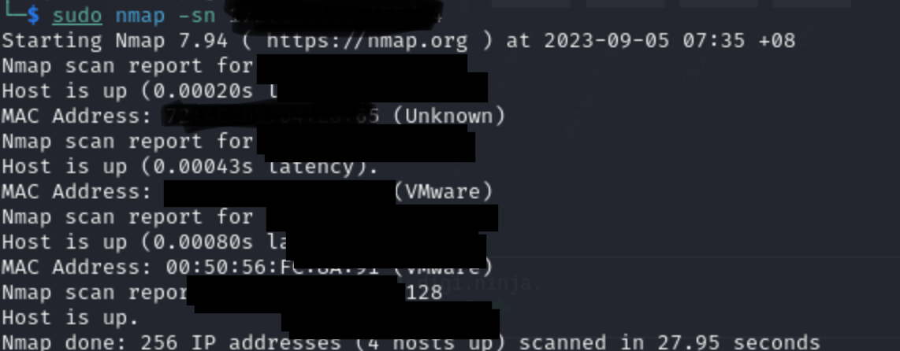
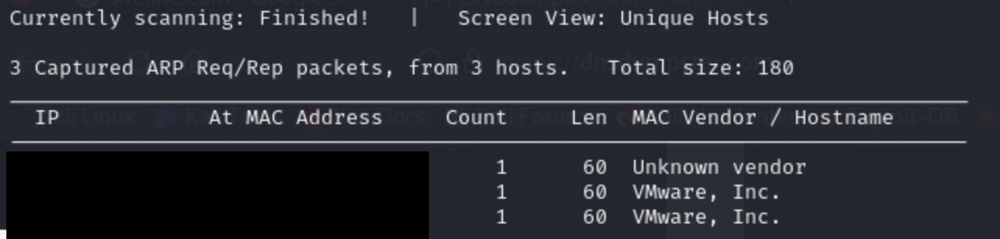

[Introduction to  Information Gathering](../Introduction%20to%20%20Information%20Gathering.md)

- Before going into port scanning or any active recon, host discovery is a recommended process to understand what hosts are connected in given target
- ICMP echo request is not a port scan and hence likely not trigger any detection.

## Nmap Commands
- `-sn` : ICMP echo request which is no port scan , TCP SYN to port 443 and TCP ACK to port 80. `sudo` is required. 
	- eg : `sudo nmap -sn {target ip}`

### Alternative of Nmap -sn command
- `sudo netdiscover -i eth0 -r {target}`
	- The command triggers ARP request

