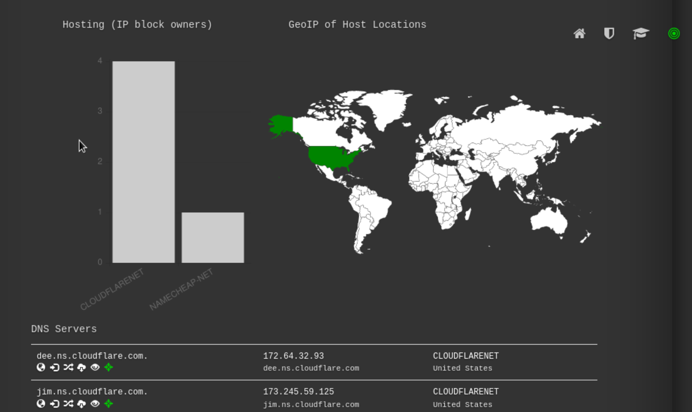
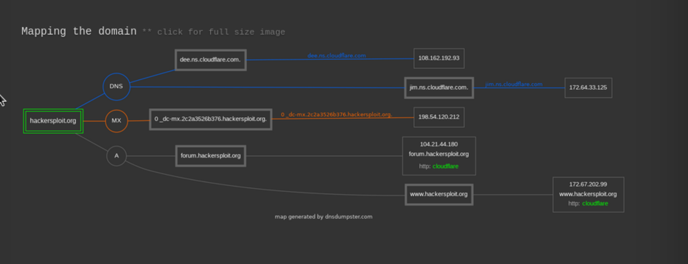

[Introduction to  Information Gathering](../Introduction%20to%20%20Information%20Gathering.md)

## DNS recon as a tool
- What is DNS recon : A tool on Kali Linux ( Pre installed ) where you can check target's DNS related dat 
	- Link : [DNS Recon tool site](https://www.kali.org/tools/dnsrecon/)
			- `dnsrecon -d {domain_name}`
				- Gives you most of the DNS related data 
- Alternative tool : [dnsdumpster](https://dnsdumpster.com/)

- The tool gives you in detailed DNS data in visual. Has great details with various records

