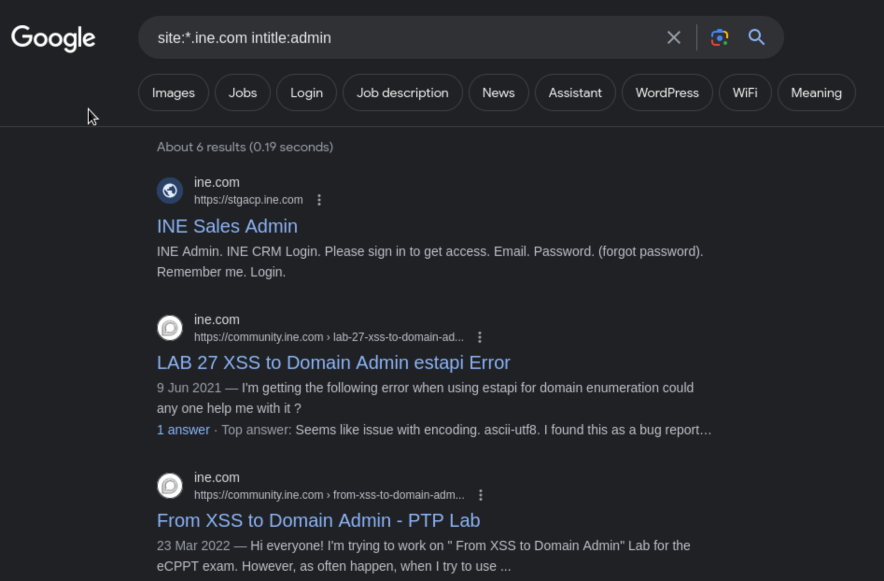
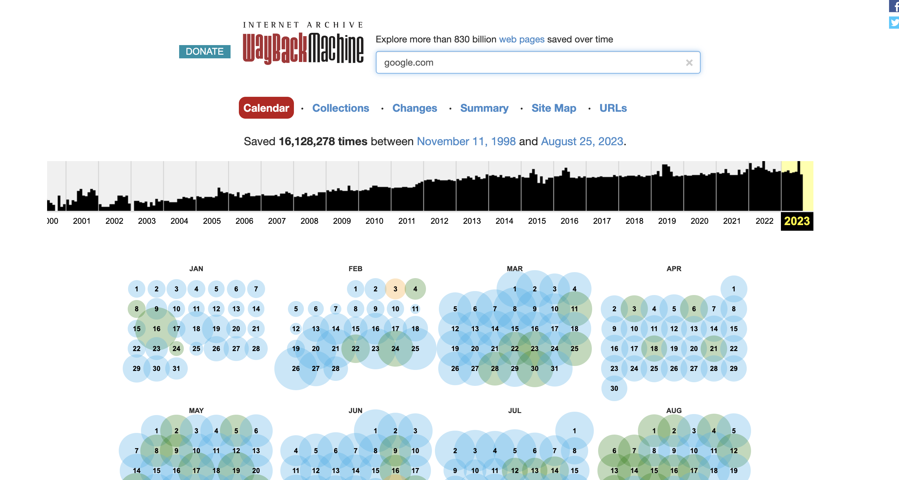

[Introduction to  Information Gathering](../Introduction%20to%20%20Information%20Gathering.md)

## Google Dorks 
- To gain target intel using Google search filter
	- Subdomains
	- Files associated to target ( pdf etc )

## Command and Usage
- `site:{domain name}` : Limit search results under target domain. This will return subdomains as well
	- Useful but still vague
	- eg : `site:ine.com`
- `site:{domain name} inurl:{keyword}`: Get url related to the specific keyword in the url 
	- eg: `site:ine.com inurl:forum`
- `site:{*.sld.tld}`: returns subdomains of the second-level domain
	- eg: `site:*.ine.com` 
- `site:{*.sld.tld} intitle:{keyword}`: Return pages which are subdomain of the website and has specific keyword in the title
	- eg: `site:*.ine.com intitle:admin`
	
- `site:{domain name} filetype:{filetype}`: To return website with specific filetype
	- eg: `site:*.ine.com filetype:pdf`
- `site:{domain name} {keyword}` : simple query of targeting a domain and keyword
	- eg: `site:*.ine.com employees`
- `intitle:index of`: would return website index pages. 
	- This is not ideal because data is likely exposed to public publicly. Beware, many websites show up in this query might be illegal websites. 
- `inurl:password.txt`: Getting the url with possible password list.
- `intitle:"index of""credentials"` : Returns a url of index page with "credentials" included. This would likely return information index which has credential information. Again, these websites might be useful for recon, but might also be malicious too.
- `inurl:wp-config.bak`: returns pages of wordpress backup file. These backup files usually contain MySQL data backup, which usually has some confidential information.

## Useful page for more details in Google Hacking
- [exploit-db](https://www.exploit-db.com/google-hacking-database)has a list of useful Google hack keywords and usage. Super useful
	- **Note**: Seems like some public wifi blocks this domain, which is understandable
## Get the past website snapshot
- [Wayback machine](https://archive.org/web/)
