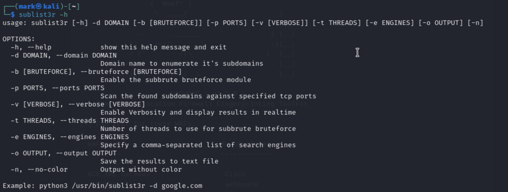
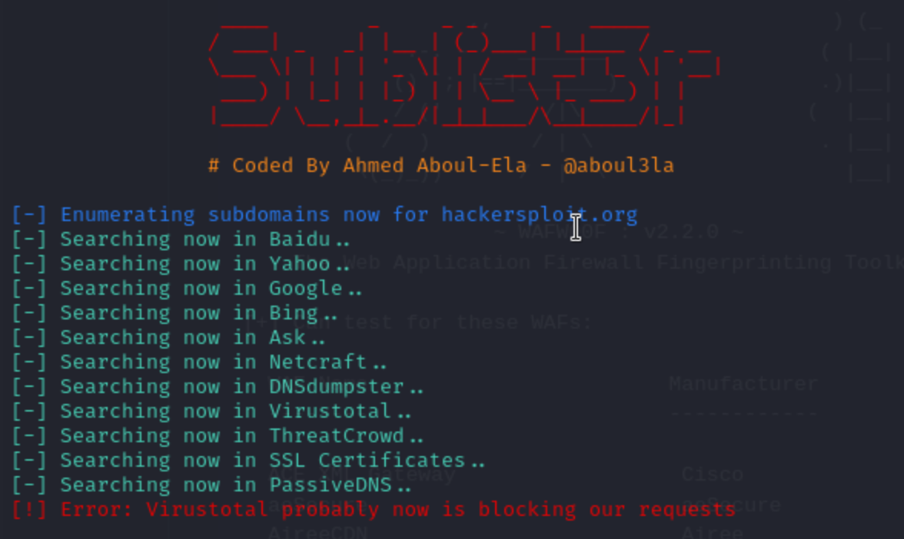

[Introduction to  Information Gathering](../Introduction%20to%20%20Information%20Gathering.md)

## What does Sublist3r do?
- Link : [Sublist3r(Github)](https://github.com/aboul3la/Sublist3r)
- Use publicly available information to see what subdomain exists under specific target domain
- **NOTE**: Sublist3r is **NOT** active recon. They are only using publicly open information. This is a passive information gathering
	- Using Google , Yahoo, Bing, etc 
	- There is a **brute force mode** (-b) , which is going to be active recon, meaning it will interact with the target system. 
## Command and usage 
- `sublist3r -d {Domain Name}` is the basic usage

- Specifying search engine
	`sublist3r -d hackersploit.org -e google,yahoo`
	  - **Warning** : The tool calls search engine API repeatedly , which can cause rate limit. After using the tool, you might get a Captcha authentication on Google page and / or sublist3r getting blocked for given time.
