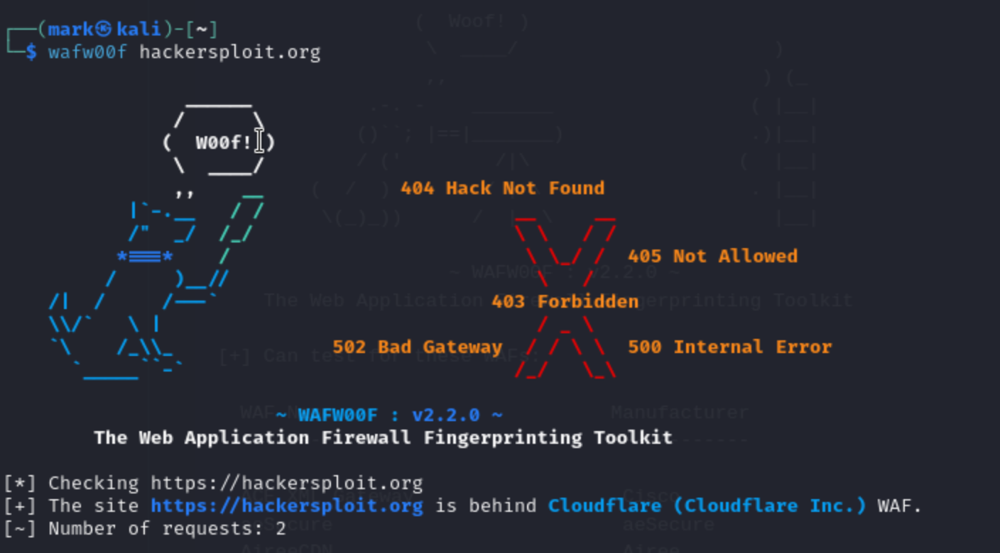

[Introduction to  Information Gathering](../Introduction%20to%20%20Information%20Gathering.md)
## What is WAF
- Web Application Firewall

## What does wafw00f do ?
- A web application firewall fingerprint tool to detect what sort of firewall is configured
	- Link : [wafw00f](https://github.com/EnableSecurity/wafw00f)
		- Pre installed in kali
	- Use `wafwoof -l` to get the list of supported WAF.
	- Example use-case : If the domain is protected by cloudflare, you might likely to fail the recon. Using wafw00f will let you know if the domain is using cloudflare and based on that recon result, you can then recalibrate your strategy

	- **Note**: wafw00f does not cover all the WAFs existing, so you might need to do additional active recon if necessary
	