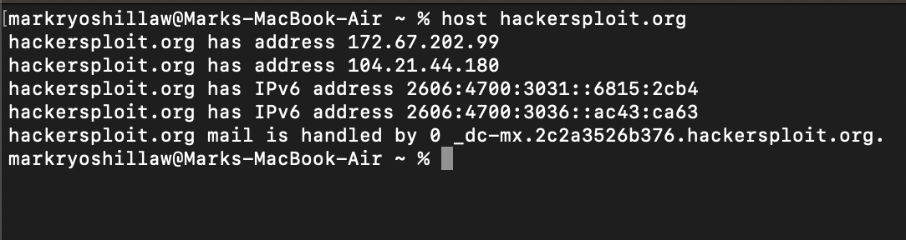
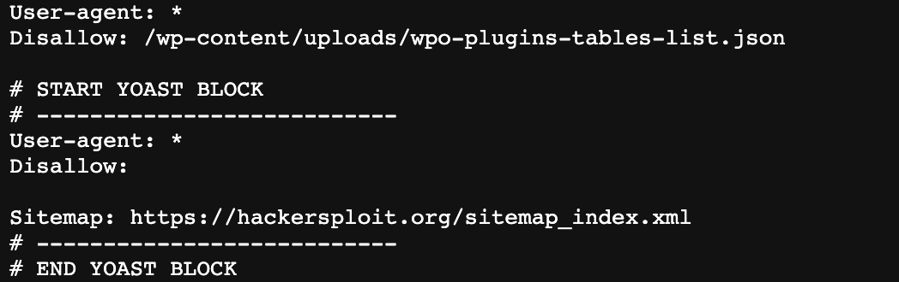

[Introduction to  Information Gathering](../Introduction%20to%20%20Information%20Gathering.md)

**Footprinting**: Gain information of a specific target

## What information to gain from footprinting
1. IP Addresses
2. Hidden Directories
3. Names
4. Email Addresses
5. Phone Numbers
6. Physical Addresses
7. Web Technologies used

Demo website --> [hackersploit.org](https://www.hackersploit.org)

## Gaining IP address from a website
- `host {domain name}` should return the IP address
	

	- Why the demo website has two IPv4 ? : Because of proxy IP the owner is using via cloudflare

## Find missing subdirectories
- Almost every website has `robots.txt` in which you can specify a page(s) not to be crawled

 
- gaining access to sitemap.xml
	- shows the entire list of subdomains which can be accessed 
## Technology profiler to understand used tech
- [https://builtwith.com/](https://builtwith.com/)
	- A website you can use to check what technologies the website uses

	- Alternative tool : [https://www.wappalyzer.com/](https://www.wappalyzer.com/)
## Copy / Download the website content
- [https://www.httrack.com/](https://www.httrack.com/)
	- Enable the system to read website.
