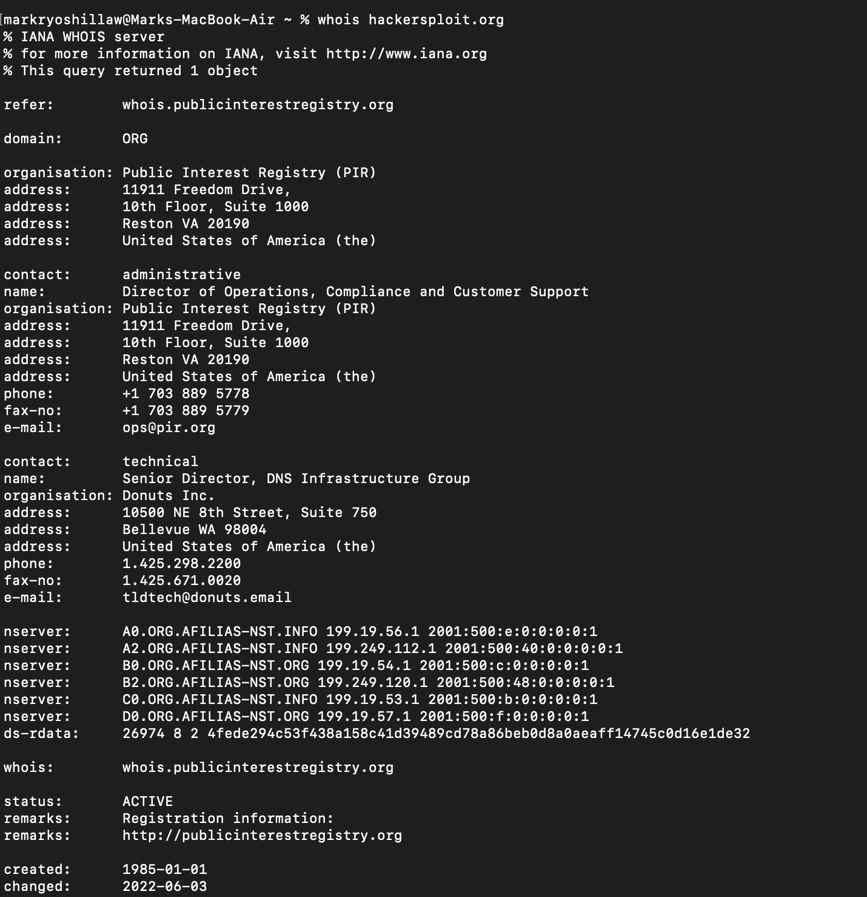
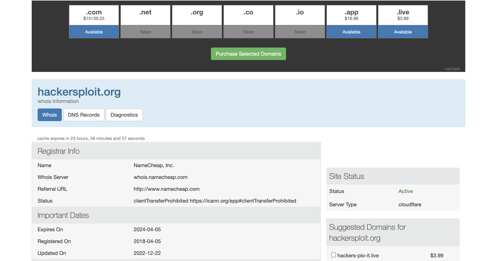

[Introduction to  Information Gathering](../Introduction%20to%20%20Information%20Gathering.md)
## whois
- An internet protocol where you can query database of website related resources such as ownership and registration
	- use `whois {domain name}` on terminal
		- eg : `whois hackersploit.org`

	- You can use [who.is](https://who.is/)a website version whois

	- **Note**: whois will redact some of the sensitive information